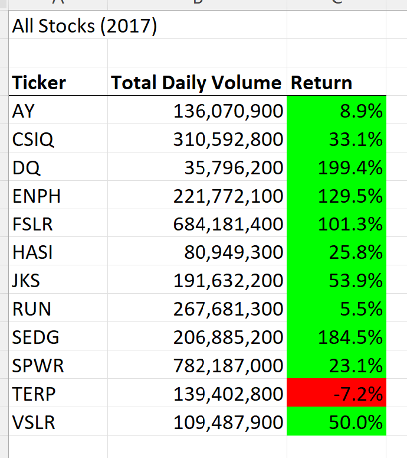
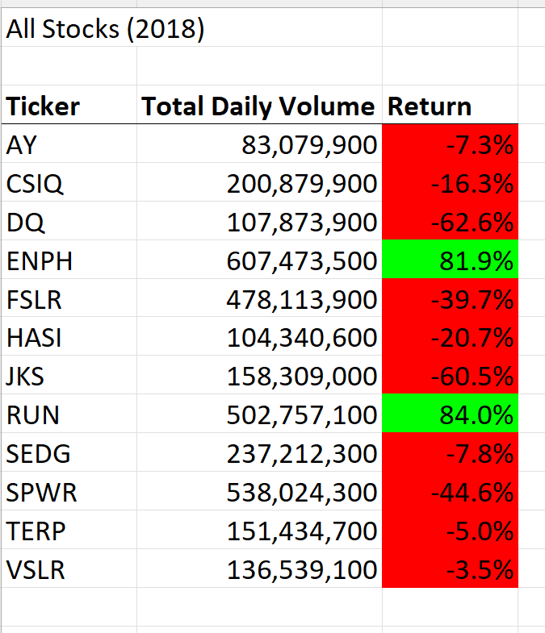
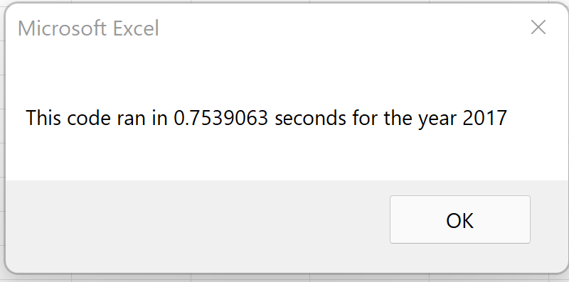
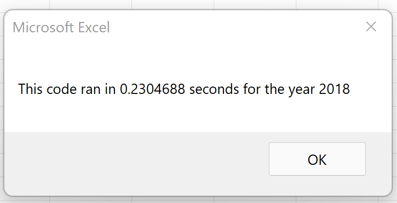

# Election_Analysis with VBA

## Overview of the Project
### Purpose 
Steve want to know how DQ perfomed, beacuse his parents want o invest. We calculated the yearly returned for DQ. Also edit or refactor the solution code to loop through all the data one time in order to collect the same information from the first code from module 2 and see other stock options to consider . 

### Analysis and Results
The yearly retunr is the percentage increase or decrese in price from the begging of the year to the end of the year. The yearly retun for DQ stcok from 2017 and 2018 wasn't great so I might not recomend to invest in this stock. We can see the results of the yearly return and total daily volume.

I recomend to invest in RUN stock.

### Summary 
Some of the advatages of recfatoring code is thata is takes less time and space.

In the original code we run through all the lines looking for the Ticker value. In the refectored and edited code we dont have to becuse we increase the number of the ticker when it does not match the last ticker hence going to next ticker value with out running throught the other lines. There are les conditions in the if statement making it faster to go through the rows and getting the value. 

Here are the times it took to run the macro

