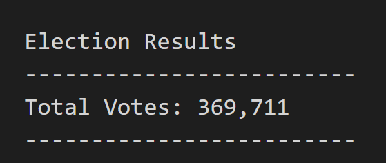
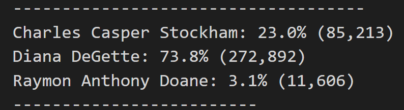

# Election_Analysis with VBA

## Overview of the Project
### Purpose 
Submit election audit results to the election commission. Election results have total of votes, total  number of votes for each candidate, percentage of votes for each candidate and winner of the election. Also the voter turnout for each county, percentage of votes from each county out of the total count and the county with the highest turnout. 

### Analysis and Results
In the election result we can see there were 369,711 total of votes.

Countys turout o
There are 3 countys that voted  
-Jefferson with 10.5 % (38,855) 
-Denver with 82.8% (306,055) 
-Arapahoe with 6.7%.(24,801)

We can determine that Denver has the greater turnout for county voters. 

Received Candidates votes: 
-Charles Casper Stockham 23%
-Diana DeGette 73.8%
-Raymond Anthony Doane 3.1%

We can determine that Diana DeGette is the winner with a winning vote of 272,892 (73.8%) of votes.

### Summary 
This script can provide an election analysis based on caountys and candidates, is does not matter the numeber of either. The script will determine de cauntys turnout and the candidate winner with number of votes and percentage of them. It will also print a text file with all the information.
